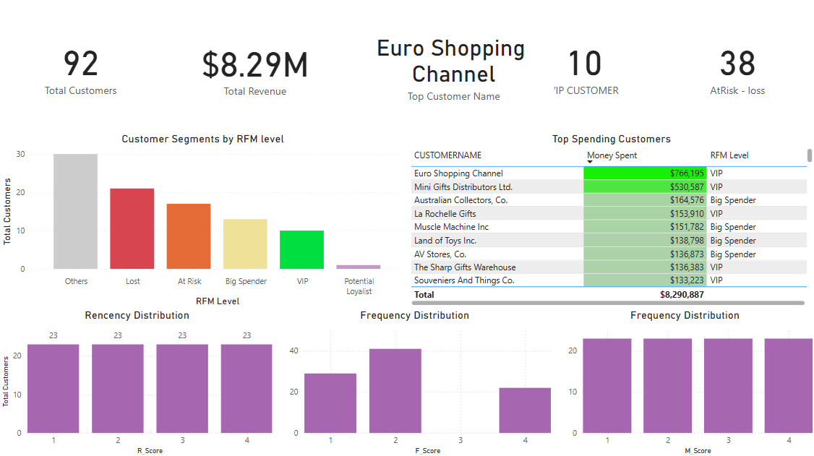

# Sales Analysis by RFM Model


# Table of Contents
- [Objective](#objective)
- [Data Source](#data-source)
- [Project Stages](#project-stages)
- [Design & Mockup](#design--mockup)
- [Tools](#tools)
- [Data Exploration](#development--pseudocode)
- [Data Cleaning & Preparation](#data-cleaning--testing)
  - [Objective](#Objective)
  - [Detecting Data Issues](#detecting-data-issues)
  - [Dropping Irrelevant Columns](#dropping-irrelevant-columns)
  - [Processing Steps in Excel](#processing-steps-in-excel)
  - [Output](#Output)
- [RFM Modeling with SQL Server](#rfm-modeling-with-sql-server)
  - [Purpose](#purpose)
  - [Key Steps](#key-steps)
  - [Output](#output)
- [Power BI Dashboard Development](#power-bi-dashboard-development)
  - [Objective](#objective)
  - [DAX Measures Created](#dax-measures-created)
  - [Dashboard Component](#dashboard-components)
- [Insight Extraction & Recommendations](#insight-extraction--recommendations)
  - [Findings](#findings)
  - [Recommendations](#recommendations)
- [Conclusion](#conclusion)


# Objective  
The goal of this project is to perform a full-cycle customer analytics pipeline using real-world transactional sales data. By applying the RFM (Recency, Frequency, Monetary) model, we segment customers based on their purchasing behavior and translate those insights into actionable business strategies.

This project covers the complete data analytics process:
- Cleaning and transforming raw sales data using Excel  
- Modeling and segmenting customers with SQL-based RFM scoring  
- Designing an interactive Power BI dashboard to uncover insights  
- Recommending targeted CRM and marketing actions based on data

# Data Source  
- **Dataset**: Sales transaction data sourced from [Kaggle](https://www.kaggle.com/datasets/kyanyoga/sample-sales-data)

The dataset reflects simulated global sales activity and serves as a rich source for behavioral segmentation using the RFM model.

# Project Stages    
1. **Data Exploration**  
2. **Data Cleaning & Preparation (Excel)**  
3. **RFM Modeling with SQL Server**  
4. **Power BI Dashboard Development**  
5. **Insight Extraction & Recommendations**  
6. **Project Documentation**  

# Design & Mockup  
To uncover meaningful insights from customer transaction data, this project aims to answer the following key questions:

1. **Who are the most valuable customers?**
   - Identify top spenders and VIP customers using RFM segmentation.

2. **Which customers are at risk of churning?**
   - Detect customers with high Frequency/Monetary but low Recency.

3. **What is the distribution of customer behavior?**
   - Segment customers by RFM score and level (e.g., Lost, Loyal, Potential).

4. **How can we prioritize retention and marketing strategies?**
   - Recommend actions based on customer value and risk level.

5. **Are there any unexpected patterns in spending behavior?**
   - Analyze anomalies or opportunities within "Others" or low-F score groups.

**Power BI dashboard layout includes:**
- KPI Cards (Total Customers, Revenue, VIPs, Lost Customers)
- Pie Chart (Customer segmentation by RFM_LEVEL)
- Bar Charts (R, F, M Score distributions)
- Table (Top 10 high-spending customers)
- Slicers (By RFM Level, Score)

# Tools  
This project showcases the integration of four essential tools in the data analytics pipeline:

| Tool                 | Purpose                                                                 |
|----------------------|-------------------------------------------------------------------------|
| **Microsoft Excel**      | Data cleaning, transformation, and initial validation. Created `ACTUAL_SALES`, standardized date formats, and handled missing values. |
| **Microsoft SQL Server**| Built the entire RFM segmentation model using CTEs and percentile logic. Demonstrated advanced SQL capabilities including conditional scoring and customer segmentation. |
| **Power BI**             | Developed an interactive dashboard with KPI Cards, score distribution, segmentation visuals, and customer-level insights. Integrated DAX measures and slicers for user exploration. |
| **GitHub**               | Hosted the full project documentation, code versioning, and README-based walkthrough for public portfolio showcasing. |

Each tool was used for what it does best—Excel for data prep, SQL for logic-heavy modeling, Power BI for visual storytelling, and GitHub for version control and public visibility.


# Data Exploration

Before diving into modeling, it's essential to explore the raw dataset
**Dataset Overview**
- **Size**: 2,823 rows × 25 columns
- **Structure**: Includes order info, product pricing, customer details, and geographic metadata

**Key Exploration Findings**

| Aspect              | Observation                                                                 |
|---------------------|------------------------------------------------------------------------------|
| **Data Types**      | Dates stored as text, numeric columns are mixed with string formatting       |
| **Missing Values**  | Lots of missing values in `POSTALCODE`, some missing `STATE`, `TERRITORY`         |
| **Revenue Issues**  | Column `SALES` had discrepancies when re-calculated from `PRICEEACH * QUANTITYORDERED` |
| **Duplicates**      | Checked via `ORDERNUMBER + PRODUCTCODE` → No exact duplicates found          |
| **Irrelevant Fields** | Columns like `PHONE`, `ADDRESSLINE2`, `CONTACTNAME` not used in RFM analysis  |
| **Geographic Data** | Some columns present but not useful for customer behavior segmentation       |

**Initial Distributions**
- Most orders are concentrated in a few frequent buyers
- Many customers made only 1–2 purchases
- High variance in monetary value across transactions

This exploration guided our decisions in the cleaning stage and ensured the focus remained on columns relevant to customer-level behavior modeling.

# Data Cleaning & Preparation (Excel)  

## Objective
- Clean and standardize raw Kaggle dataset
- Identify and resolve revenue inconsistencies
- Remove columns not serving behavioral analysis
- Prepare dataset for SQL-based segmentation

---
## Detecting Data Issues

Upon initial inspection, the dataset contained a `SALES` column, representing line-level revenue. However, when we validated it against the actual logic:

```
ACTUAL_SALES = PRICEEACH * QUANTITYORDERED
```

-> The values did not consistently match, indicating data quality issues.

**Decision**: Discarded the unreliable `SALES` column and created a new, trusted column `ACTUAL_SALES` to ensure accurate analysis.

---

## Dropping Irrelevant Columns

Out of 25 columns in the original dataset, only around 8–9 were required for RFM analysis. We removed the following:

| Category            | Columns Removed                                   | Reason                                  |
|---------------------|---------------------------------------------------|-----------------------------------------|
| Contact & Address   | PHONE, ADDRESSLINE1, ADDRESSLINE2, CITY, STATE, COUNTRY | Not relevant to behavior analysis       |
| Personal Info       | CONTACTFIRSTNAME, CONTACTLASTNAME                | Redundant with CUSTOMERNAME             |
| Order Management    | STATUS, ORDERLINENUMBER, QTR_ID, MONTH_ID, YEAR_ID | Duplicates ORDERDATE or metadata        |
| Product Segments    | PRODUCTLINE, MSRP, DEALSIZE, TERRITORY           | Not required for customer-level RFM     |

Key Columns Used in This Project:
| Column         | Description                                      |
|----------------|--------------------------------------------------|
| ORDERNUMBER    | Unique identifier for each order                 |
| ORDERDATE      | Date of the transaction                          |
| CUSTOMERNAME   | Name of the customer                             |
| PRICEEACH      | Price per item                                   |
| QUANTITYORDERED| Number of items ordered                          |
| SALES          | System-generated sales field (later replaced)   |
| ACTUAL_SALES   | Calculated as `PRICEEACH * QUANTITYORDERED`     |
| POSTALCODE     | Used for potential geographic analysis           |
| PRODUCTCODE    | Used to check for duplicates within transactions |

---

## Processing Steps in Excel

| Step | Action                              | Description |
|------|-------------------------------------|-------------|
| 1    | Created `ACTUAL_SALES`              | Formula: `=PRICEEACH * QUANTITYORDERED`, rounded to 2 decimals |
| 2    | Standardized `ORDERDATE`            | Converted to format `yyyy-mm-dd` |
| 3    | Dropped unnecessary columns         | As listed above |
| 4    | Handled missing `POSTALCODE`        | Filled using other rows with same `CUSTOMERNAME` |
| 5    | Checked for duplicate orders        | Used helper column: `ORDERNUMBER & PRODUCTCODE`, then COUNTIFS() |
| 6    | Sorted data by `ORDERDATE`          | For Recency calculation validation |
| 7    | Exported cleaned dataset            | Saved as `sales_data_cleaned.csv` for SQL analysis |

---

## Output

- Clean, complete, and analysis-ready dataset
- Verified revenue field (`ACTUAL_SALES`)
- Trusted input for all downstream SQL and visualization tasks

# RFM Modeling with SQL Server

## Purpose 

To group customers based on their behavior using three core metrics:
- **Recency**: How recently a customer placed an order
- **Frequency**: How often they purchased
- **Monetary**: How much they spent

---

## Key Steps

***1. Aggregate RFM Metrics***
```sql
WITH rfm_base AS (
  SELECT 
    CUSTOMERNAME,
    DATEDIFF(DAY, MAX(ORDERDATE), (SELECT MAX(ORDERDATE) FROM sales_data)) AS Recency,
    COUNT(DISTINCT ORDERNUMBER) AS Frequency,
    ROUND(SUM(ACTUAL_SALES), 2) AS Monetary
  FROM sales_data
  GROUP BY CUSTOMERNAME
)
```

***2. Calculate Quartile Thresholds***
```sql
, quartiles AS (
  SELECT
         DISTINCT
         PERCENTILE_CONT(0.25) WITHIN GROUP (ORDER BY recency) OVER() AS r_25,
         PERCENTILE_CONT(0.5) WITHIN GROUP (ORDER BY recency) OVER() AS r_50,
         PERCENTILE_CONT(0.75) WITHIN GROUP (ORDER BY recency) OVER() AS r_75,
			PERCENTILE_CONT(0.25) WITHIN GROUP (ORDER BY frequency) OVER() AS f_25,
			PERCENTILE_CONT(0.5) WITHIN GROUP (ORDER BY frequency) OVER() AS f_50,
			PERCENTILE_CONT(0.75) WITHIN GROUP (ORDER BY frequency) OVER() AS f_75,
			PERCENTILE_CONT(0.25) WITHIN GROUP (ORDER BY monetary) OVER() AS m_25,
			PERCENTILE_CONT(0.5) WITHIN GROUP (ORDER BY monetary) OVER() AS m_50,
			PERCENTILE_CONT(0.75) WITHIN GROUP (ORDER BY monetary) OVER() AS m_75
  FROM rfm_base
)
```

***3. Assign R, F, M Scores (1 to 4)***
```sql
, rfm_scored AS (
  SELECT r.*,
         -- R_Score: Recency smaller is better
		   CASE
			   WHEN r.recency <= q.r_25 THEN 4
			   WHEN r.recency <= q.r_50 THEN 3
			   WHEN r.recency <= q.r_75 THEN 2
			ELSE 1
		   END AS R_Score,

		   -- F_Score: Frequency bigger is better
		   CASE
			   WHEN r.frequency <= q.f_25 THEN 1
			   WHEN r.frequency <= q.f_50 THEN 2
			   WHEN r.frequency <= q.f_75 THEN 3
			   ELSE 4
		   END AS F_Score,

   		-- M_Score: Monetary bigger is better
   		CASE
   			WHEN r.monetary <= q.m_25 THEN 1
   			WHEN r.monetary <= q.m_50 THEN 2
   			WHEN r.monetary <= q.m_75 THEN 3
   			ELSE 4
   		END AS M_Score
    FROM rfm_base r
   CROSS JOIN quartiles q
)
```

***4. Generate Final RFM Table***
```sql
, rfm_final AS (
  SELECT *,
    CAST(R_SCORE AS VARCHAR) + CAST(F_SCORE AS VARCHAR) + CAST(M_SCORE AS VARCHAR) AS RFM_SCORE,
    CASE 
      WHEN R_SCORE=4 AND F_SCORE=4 AND M_SCORE=4 THEN 'VIP'
      WHEN R_SCORE=4 AND F_SCORE<=2 THEN 'Big Spender'
      WHEN R_SCORE=1 AND F_SCORE>=3 THEN 'At Risk'
      WHEN R_SCORE=1 AND F_SCORE=1 THEN 'Lost'
      ELSE 'Others'
    END AS RFM_LEVEL
  FROM rfm_scored
)
```

***5. Export to New Table***
```sql3
SELECT * INTO rfm_results FROM rfm_final;
```

---

## Output
- Table `rfm_results` contains:
  - RFM metrics and scores
  - Composite `RFM_SCORE`
  - Behavior segment: `RFM_LEVEL`
  


This structured output feeds directly into Power BI for interactive analysis.

---

# Power BI Dashboard Development  
After preparing the `rfm_results` table in SQL, exported it as a `.csv` and loaded it into Power BI to design an interactive dashboard. This dashboard enables clear customer segmentation and supports business decision-making.

---

## Objective

- Visualize RFM scores and levels to understand customer behavior
- Track key metrics (revenue, VIPs, customer distribution)
- Enable filtering and slicing for deeper insight exploration

---

## Visualization Results



## DAX Measures Created

```DAX
Total Customers = DISTINCTCOUNT(rfm_results[CUSTOMERNAME])
Total Revenue = SUM(rfm_results[Monetary])
VIP Customers = CALCULATE(COUNTROWS(rfm_results), rfm_results[RFM_LEVEL] = "VIP")
Lost Customers = CALCULATE(COUNTROWS(rfm_results), rfm_results[RFM_LEVEL] = "Lost")
Top Customer = CALCULATE(MAX(rfm_results[Monetary]))
```

These measures were used in KPI Cards and visual breakdowns.

---

## Dashboard Components

| Element           | Type           | Purpose                                         |
|------------------|----------------|-------------------------------------------------|
| KPI Cards         | Numeric Tiles  | Show Total Customers, Revenue, VIPs, Lost       |
| Pie Chart         | Donut Visual   | RFM_LEVEL Distribution                          |
| Bar Charts        | Clustered Bars | Distribution of R, F, and M Scores              |
| Table             | Matrix Table   | Top customers with RFM_SCORE and Monetary       |
| Slicers           | Filter widgets | Filter dashboard by RFM_LEVEL and RFM_SCORE     |

---

**Visual Design Considerations**

- Color-coded RFM levels for better segmentation visibility
- Conditional formatting in tables (e.g., high monetary in darker color)
- Slicers placed at top-right for quick filtering
- Grouped visuals for comparative storytelling (e.g., Score charts side-by-side)

---

**Dashboard Layout**

- Header row: KPI Cards
- Middle row: Pie chart + Score Bar Charts
- Bottom row: Detailed Table with slicers
---

**Outcome**

- Highly interactive dashboard with multiple exploration paths
- Supports decision-making for marketing & retention
- Prepares the ground for strategy formulation based on customer value

# Insight Extraction & Recommendations

## Findings

Using the final Power BI dashboard, address the key analytical questions defined earlier:

|  Business Question |  Insight from Power BI |
|----------------------|--------------------------|
| **1. Who are the most valuable customers?** | The *Top 10 Customers* table shows that clients like **Euro Shopping Channel** and **Mini Gifts Distributors Ltd.** contribute the highest revenue (over $1.2M combined). Their RFM Level is classified as **VIP**. |
| **2. Which customers are at risk of churning?** | The segment with `R_SCORE = 1` and high F/M values appears under the **At Risk** group. Pie charts reveal this group accounts for approximately **12% of all customers**. |
| **3. What is the distribution of customer behavior?** | The **R, F, M bar charts** show that most customers have **low frequency** and **moderate monetary** values, highlighting uneven engagement. |
| **4. How can we prioritize retention strategies?** | **Big Spenders** and **Potential Loyalists** (e.g., R=4, M=4, F=1–2) show strong potential for upselling and loyalty campaigns. This insight drives marketing prioritization. |
| **5. Are there any unexpected patterns in behavior?** | Customers in the **Others** segment occasionally show high recency spikes despite low F/M. These are **early signs of potential reactivation or new interest**. |

These insights connect the dashboard to real business actions, demonstrating the value of data-driven decision-making.

## Recommendations

Based on the RFM segmentation and dashboard insights, we suggest the following data-driven actions:

- **VIP Customers** (High RFM):  
  Offer exclusive membership tiers, early access to new products, and priority support. These customers are already loyal and profitable—focus on deepening the relationship and maximizing lifetime value.

- **Big Spenders** (High Monetary, Low Frequency):  
  Trigger personalized cross-sell and up-sell campaigns. While these customers spend a lot per order, they buy infrequently. Time-limited bundles or loyalty points can drive more frequent purchases.

- **Potential Loyalists** (High Recency, Moderate Frequency/Monetary):  
  Build onboarding journeys, post-purchase touchpoints, and personalized engagement. These are promising customers who could become VIPs if nurtured correctly.

- **At Risk** (Low Recency, High Frequency or Monetary):  
  Run win-back campaigns with reminders, feedback requests, and targeted promotions. These customers were previously valuable but have recently disengaged.

- **Lost Customers** (Low RFM):  
  Launch remarketing ads or dormant customer surveys. Offer comeback vouchers but allocate minimal budget—these users are low-return and should not be over-invested in.

---

# Conclusion

This project demonstrates a complete analytics workflow: from cleaning raw sales data to segmenting customers with SQL and presenting business insights via Power BI.

We not only delivered a functional RFM model, but also translated the output into **actionable strategies** that align with marketing, CRM, and customer retention goals.

By combining analytical rigor with business relevance, this project shows how data can empower smarter decision-making and stronger customer relationships.
